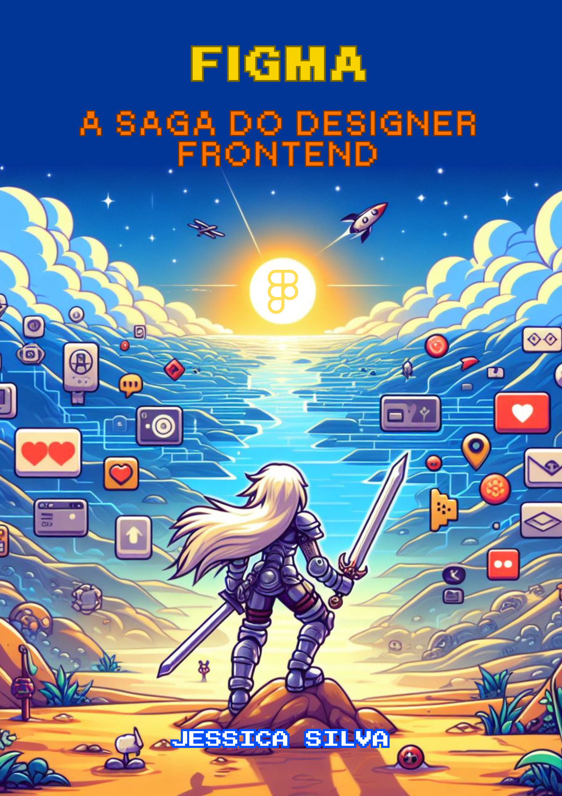

    

    
    

-------

    

# Projeto EBOOK Gerado por I.A.s

 > ℹ️ **NOTE:** Este é o repositório desenvolvido durante o curso no qual fui aluna na plataforma da [DIO](https://dio.me)

Projeto com o objetivo de gerar um ebook digital com as facilidades das ferramentas de IA. todos os prompts
seguem abaixo.

<a href="https://github.com/felipeAguiarCode/prompts-recipe-to-create-a-ebook/blob/main/output/ebook%20-%20css%20jedi%20output.pdf" title="View PDF now"> 📕Clique aqui para ler</a>

## 💻 Tecnologias utilizadas no projeto

- [ChatGPT](https://chat.openai.com/) 
- [Bing - Gerador de Imagens](https://www.bing.com/images/create?cc=br)
- [Canva](https://www.canva.com/)

## 🧠 Prompts

ChatGPT：

|   Ação   | prompt                                                                                                                                                                                                                                                                         |
| :------: | ------------------------------------------------------------------------------------------------------------------------------------------------------------------------------------------------------------------------------------------------------------------------------ |
|  título  | Crie um título de um ebook sobre o tema de css, o ebookk é do nicho de programação e o subnicho é de css, o título deve ser épico e curto, e tenha uma temática de star wars no título, me liste 5 variações de títulos                                                        |
| conteúdo | Faça um texto para ebook , com foco em CSS, listando os principais seletores CSS com exemplos em código {REGRAS} Explique sempre de uma maneira simples Deixe o texto enxuto, Sempre traga exemplos de código em contextos reais , sempre deixe um título sugestivo por tópico |

Midjourney：

|  Ação  | prompt                                                                                 |
| :----: | -------------------------------------------------------------------------------------- |
| título | A jedi in meditation pose, with your blue lightsaber floating, pixel art style --v 5.1 |

## ✨ Features

- Conteúdo gerado via ChatGPT
- Imagens geradas via Bing

## 📚 Materiais

- Imagens utilizadas em `assets`
- ebook gerado durante as aulas em `output`

## 🛠️ Instruções de execução

Utilize os prompts acima nas ferramentas sugeridas para gerar o material base e utilize uma ferramenta de edição de documentos como power point, libreoffice , indesign para diagramação.

## 👨‍💻 Expert

    
    
&nbsp&nbsp&nbspJessica Silva 
    &nbsp&nbsp&nbsp
        <a href="https://github.com/outrasilva">GitHub</a>&nbsp;|&nbsp;
        <a href="https://www.linkedin.com/in/jessicamariasilva1995">LinkedIn</a>&nbsp;|&nbsp;

  

## 👨‍🏫 Professor

    
    
&nbsp&nbsp&nbspFelipe Aguiar 
    &nbsp&nbsp&nbsp
    <a href="https://github.com/felipeAguiarCode">
    GitHub</a>&nbsp;|&nbsp;
    <a href="www.linkedin.com/in/
felipe-exe">LinkedIn</a>
&nbsp;|&nbsp;
    <a href="https://www.instagram.com/felipeaguiar.exe/">
    Instagram</a>
&nbsp;|&nbsp;

  

---

⌨️ com 💜 por [Felipe Aguiar](https://github.com/outrasilva)
